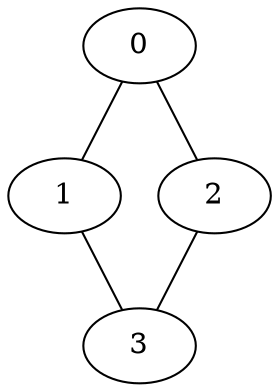

# 📚 File-by-File Explanation Guide

This document explains **every file** in this repository in simple, easy-to-understand language with examples. Perfect for beginners!

---

## 🎯 What is This Repository About?

This repository implements **Breadth-First Search (BFS)** - an algorithm that explores a graph (network of connected points) level by level. Think of it like exploring a maze by checking all nearby rooms first before moving further away.

The repository has **two versions**:
1. **Sequential** - Does the work one step at a time (slower but simple)
2. **Parallel** - Uses multiple threads to work simultaneously (faster for large graphs)

---

## 📁 File Explanations

### 1. `bfs_sequential.cpp` 
**What it is:** The sequential (single-threaded) BFS implementation  
**Purpose:** Serves as the baseline to compare against the parallel version

**In Simple Terms:**
This is like having one person explore a building room by room. The person:
- Starts at a room (starting node)
- Checks all connected rooms (neighbors)
- Marks visited rooms so they don't visit twice
- Continues until all reachable rooms are explored

**Example from the code:**
```cpp
// Starting from room 0, explore 10,000 rooms
bfs_seq --n 10000 --deg 8 --start 0
```
- `--n 10000`: Building has 10,000 rooms
- `--deg 8`: Each room connects to ~8 other rooms
- `--start 0`: Start exploring from room 0

**Output:**
```
Seq_time_s=0.025000      (took 0.025 seconds)
Visited_count=10000      (explored all 10,000 rooms)
```

**Key Features:**
- Uses a simple queue to track which room to visit next
- Records the "level" (distance) from the start for each room
- Very straightforward but processes one room at a time

---

### 2. `bfs_openmp.cpp`
**What it is:** The parallel (multi-threaded) BFS implementation using OpenMP  
**Purpose:** Speed up BFS by using multiple threads to explore simultaneously

**In Simple Terms:**
This is like having 8 people explore a building together. Each person:
- Takes a portion of rooms to explore in parallel
- Uses atomic operations (like taking turns) to avoid conflicts
- Coordinates at each level before moving deeper

**Example from the code:**
```cpp
// Use 8 threads to explore 1,200,000 rooms
$Env:OMP_NUM_THREADS = 8
bfs_par --n 1200000 --deg 8 --start 0 --iters 20
```
- `OMP_NUM_THREADS = 8`: Use 8 parallel workers
- `--n 1200000`: Building has 1.2 million rooms
- `--iters 20`: Repeat 20 times to get accurate timing

**Output:**
```
Seq_time_s=4.241000      (sequential took 4.24 seconds)
Par_time_s=1.450000      (parallel took 1.45 seconds)
Speedup=2.924827         (2.92x faster!)
Level_check=OK           (both methods got same results)
```

**Key Features:**
- Level-synchronous approach: all threads finish one level before starting next
- Atomic visited array: prevents two threads from visiting the same room
- Dynamic scheduling: balances work across threads

**Special Modes:**
```cpp
// Directed graph (one-way connections)
bfs_par --n 200000 --deg 8 --start 0 --directed

// Load graph from file
bfs_par --n 1157828 --start 1 --file com-youtube.ungraph.txt
```

---

### 3. `graph_utils.h`
**What it is:** Shared helper functions for both programs  
**Purpose:** Code reuse - avoids duplicating common functionality

**In Simple Terms:**
Think of this as a toolbox that both the sequential and parallel programs share. It contains:

1. **Graph Building Tools**
   ```cpp
   make_synthetic_graph(n, deg, directed, seed)
   // Creates a random graph with n nodes, ~deg connections per node
   ```
   - Like drawing a random map with rooms and hallways
   - Each room connects to approximately `deg` other rooms
   - Can be directed (one-way) or undirected (two-way)

2. **File Loading Tools**
   ```cpp
   load_edgelist(file, n)
   // Reads connections from a file
   ```
   - Loads a pre-made map from a text file
   - Example file format:
     ```
     0 1    (room 0 connects to room 1)
     0 2    (room 0 connects to room 2)
     1 3    (room 1 connects to room 3)
     ```

3. **Command-Line Parser**
   ```cpp
   parse_args(argc, argv, ...)
   // Reads user's command-line options
   ```
   - Handles flags like `--n 10000` or `--start 5`
   - Sets default values if user doesn't specify

**Real Example:**
```cpp
// User types:
./bfs_seq --n 50000 --deg 10 --start 42

// graph_utils.h processes this as:
n = 50000        (50,000 nodes)
deg = 10         (10 connections per node)
start = 42       (start from node 42)
file = ""        (no file, generate random graph)
seed = 42        (random seed, default)
```

---

### 4. `edges.txt`
**What it is:** Edge list file - a list of connections  
**Purpose:** Stores the graph structure in a simple text format

**In Simple Terms:**
This file is like a phone book of connections. Each line shows two rooms that are connected.

**Example Content:**
```
1 2      (room 1 connects to room 2)
1 3      (room 1 connects to room 3)
1 4      (room 1 connects to room 4)
2 5      (room 2 connects to room 5)
3 5      (room 3 connects to room 5)
```

**Visualization:**
```
    1
   /|\
  2 3 4
   \|
    5
```

**File Stats:**
- Contains ~2.9 million edges (connections)
- Generated automatically when running sequential BFS
- Used to save/share graph structures

**How it's created:**
```cpp
// In bfs_sequential.cpp, after building the graph:
for (int u = 0; u < g.size(); u++) {
    for (int v : g[u]) {
        if (u < v)   // avoid duplicate edges
            fout << u << " " << v << "\n";
    }
}
```

---

### 5. `com-youtube.ungraph.txt`
**What it is:** Real-world dataset from YouTube's social network  
**Purpose:** Test BFS on actual social network data (not random)

**In Simple Terms:**
Instead of testing on made-up data, this file contains real connections from YouTube:
- Each number represents a YouTube user
- A line like `123 456` means user 123 and user 456 are connected (e.g., friends, subscribed to each other)

**Dataset Details:**
- Source: Stanford SNAP datasets (com-Youtube)
- Nodes (users): ~1.15 million
- Edges (connections): ~2.9 million
- Type: Undirected (friendship goes both ways)

**Why Use Real Data?**
Real social networks have different properties than random graphs:
- **Hub nodes**: Some users have thousands of connections (popular YouTubers)
- **Skewed distribution**: Most users have few connections, few users have many
- **Community structure**: Groups of highly connected users

**Performance Impact:**
```
Random Graph (1.2M nodes): 2.92x speedup
YouTube Graph (1.1M nodes): 1.64x speedup
```
Real data is harder to parallelize due to irregular structure!

---

### 6. `graph.dot`
**What it is:** GraphViz DOT format file  
**Purpose:** Visual representation of graph structure

**In Simple Terms:**
This file contains instructions for drawing a picture of the graph. It's written in a special language called DOT.

**Example Content:**


**How to Use:**
```bash
# Convert DOT file to PNG image
dot -Tpng graph.dot -o graph.png

# Or use online viewer: https://dreampuf.github.io/GraphvizOnline/
```

**What You'll See:**
- Circles (nodes) representing rooms/users
- Lines (edges) showing connections
- Useful for understanding small graphs (gets messy with 1000+ nodes!)

---

### 7. `graph.png`
**What it is:** Image visualization of the graph  
**Purpose:** See the graph structure with your eyes!

**In Simple Terms:**
A picture generated from `graph.dot` that shows:
- Dots = nodes (rooms, users, vertices)
- Lines = edges (connections, hallways)

**Example Visualization:**
```
    ●
   /|\
  ● ● ●
   \|/
    ●
```

**When to Use:**
- Understanding small example graphs
- Debugging graph generation
- Presentations and teaching
- **NOT** useful for large graphs (imagine drawing 1 million dots!)

**Typical Usage:**
```bash
# Generate small test graph
./bfs_seq --n 10 --deg 3 --start 0

# Convert edges.txt to DOT format (manual step)
# Then create image:
dot -Tpng graph.dot -o graph.png
```

---

### 8. `results.txt`
**What it is:** Performance benchmark results  
**Purpose:** Documents how fast each version runs on different graphs

**In Simple Terms:**
This is like a scorecard showing race results between sequential and parallel BFS.

**Example Results:**

#### Small Graph (10,000 nodes)
```
Sequential: 0.001 seconds
Parallel:   0.004 seconds
Speedup:    0.25x (SLOWER!)
```
**Why slower?** Starting threads takes time. For tiny graphs, the overhead isn't worth it.

#### Large Graph (1,200,000 nodes)
```
Sequential: 4.241 seconds
Parallel:   1.450 seconds (with 8 threads)
Speedup:    2.92x (Almost 3x FASTER!)
```
**Why faster?** Enough work to justify using multiple threads.

#### Real Social Network (YouTube)
```
Sequential: 1.061 seconds
Parallel:   0.647 seconds (with 8 threads)
Speedup:    1.64x (64% FASTER)
```
**Why less speedup?** Real graphs have irregular structure that's harder to parallelize.

**Key Observations from Results:**
1. Parallel BFS needs large graphs to be effective
2. Synthetic graphs parallelize better than real graphs
3. More threads = better speedup (up to hardware limit)
4. All experiments verified correctness (`Level_check=OK`)

---

### 9. `readme.md`
**What it is:** Main project documentation  
**Purpose:** Overview, compilation instructions, and usage guide

**In Simple Terms:**
The instruction manual for the project. Contains:

1. **Project Overview**
   - What BFS is
   - Why we parallelized it
   - What we learned

2. **How to Compile**
   ```powershell
   # Sequential version
   g++ -O3 -std=c++17 bfs_sequential.cpp -o bfs_seq.exe
   
   # Parallel version (needs OpenMP)
   g++ -O3 -std=c++17 -fopenmp bfs_openmp.cpp -o bfs_par.exe
   ```

3. **How to Run**
   ```powershell
   # Run sequential BFS
   ./bfs_seq.exe --n 100000 --deg 8 --start 0
   
   # Run parallel BFS with 8 threads
   $Env:OMP_NUM_THREADS = 8
   ./bfs_par.exe --n 100000 --deg 8 --start 0
   ```

4. **Expected Output**
   - Timing information
   - Speedup calculations
   - Correctness verification

5. **Results Summary**
   - Performance on different graph sizes
   - Speedup analysis
   - Bottleneck identification

**Read This First!** Before diving into code, read `readme.md` to understand the big picture.

---

## 🔄 How Files Work Together

### Workflow Example: Running Parallel BFS

1. **User runs command:**
   ```bash
   ./bfs_par.exe --n 100000 --deg 8 --start 0
   ```

2. **graph_utils.h parses arguments:**
   - Sets n=100000, deg=8, start=0
   - Calls `make_synthetic_graph(100000, 8, false, 42)`

3. **graph_utils.h generates graph:**
   - Creates 100,000 nodes
   - Adds ~8 random edges per node
   - Returns adjacency list

4. **bfs_sequential.cpp runs baseline:**
   - Performs sequential BFS
   - Records time and results

5. **bfs_openmp.cpp runs parallel version:**
   - Spawns threads (determined by OMP_NUM_THREADS)
   - Distributes work across threads
   - Records time and results

6. **Compare and output:**
   - Checks if both got same answer (Level_check)
   - Calculates speedup
   - Prints results

7. **Save results:**
   - User adds output to `results.txt`
   - Can visualize small graphs using `graph.dot` → `graph.png`

---

## 🎓 Learning Path

### Beginner Level
1. Read `readme.md` - understand the project goal
2. Read `FILE_EXPLANATIONS.md` (this file!) - understand each component
3. Look at `graph.png` - see what a graph looks like visually
4. Look at `edges.txt` - see how connections are stored

### Intermediate Level
1. Read `graph_utils.h` - understand helper functions
2. Read `bfs_sequential.cpp` - understand basic BFS algorithm
3. Run small experiments:
   ```bash
   ./bfs_seq.exe --n 1000 --deg 5 --start 0
   ```
4. Look at `results.txt` - understand performance patterns

### Advanced Level
1. Read `bfs_openmp.cpp` - understand parallelization techniques
2. Study atomic operations and synchronization
3. Run performance experiments:
   ```bash
   # Test different thread counts
   $Env:OMP_NUM_THREADS = 1; ./bfs_par.exe --n 500000 --deg 8 --start 0
   $Env:OMP_NUM_THREADS = 2; ./bfs_par.exe --n 500000 --deg 8 --start 0
   $Env:OMP_NUM_THREADS = 4; ./bfs_par.exe --n 500000 --deg 8 --start 0
   $Env:OMP_NUM_THREADS = 8; ./bfs_par.exe --n 500000 --deg 8 --start 0
   ```
4. Analyze speedup trends
5. Try real-world datasets:
   ```bash
   ./bfs_par.exe --n 1157828 --start 1 --file com-youtube.ungraph.txt
   ```

---

## 📊 Quick Reference Table

| File | Type | Size | Purpose | Can I Edit? |
|------|------|------|---------|-------------|
| `bfs_sequential.cpp` | C++ Source | ~100 lines | Sequential BFS implementation | ✅ Yes |
| `bfs_openmp.cpp` | C++ Source | ~175 lines | Parallel BFS implementation | ✅ Yes |
| `graph_utils.h` | C++ Header | ~122 lines | Shared utilities | ✅ Yes |
| `edges.txt` | Data File | ~3M lines | Generated graph edges | ⚠️ Auto-generated |
| `com-youtube.ungraph.txt` | Data File | ~3M lines | Real dataset | ❌ No (source data) |
| `graph.dot` | GraphViz | Variable | Graph visualization code | ✅ Yes |
| `graph.png` | Image | Variable | Graph visualization | ⚠️ Generated from DOT |
| `results.txt` | Text | ~200 lines | Performance results | ✅ Yes (add results) |
| `readme.md` | Markdown | ~100 lines | Project documentation | ✅ Yes |

---

## 🎯 Common Questions

### Q: Which file should I start with?
**A:** Start with `readme.md` for overview, then `bfs_sequential.cpp` for the algorithm.

### Q: What's the difference between sequential and parallel?
**A:** Sequential uses 1 thread (like 1 person doing all work). Parallel uses multiple threads (like 8 people dividing work).

### Q: Why is parallel sometimes slower?
**A:** Thread overhead! For small graphs, the time to start threads exceeds the time saved. Only works well for large graphs.

### Q: What's an "atomic" operation?
**A:** Like taking turns. When multiple threads try to mark a node as visited, atomic ensures only one succeeds, preventing conflicts.

### Q: Can I use my own graph?
**A:** Yes! Create an `edges.txt` file with format `node1 node2` on each line, then use `--file edges.txt`.

### Q: What does "Level_check=OK" mean?
**A:** Both sequential and parallel BFS got the same answer - the parallel version is correct!

### Q: Why use YouTube data?
**A:** Real data tests the algorithm on actual social networks, which have different properties than random graphs.

---

## 🚀 Quick Start Commands

```powershell
# Compile both versions
g++ -O3 -std=c++17 bfs_sequential.cpp -o bfs_seq.exe
g++ -O3 -std=c++17 -fopenmp bfs_openmp.cpp -o bfs_par.exe

# Run simple test (small graph)
./bfs_seq.exe --n 10000 --deg 8 --start 0
./bfs_par.exe --n 10000 --deg 8 --start 0

# Run performance test (large graph)
$Env:OMP_NUM_THREADS = 8
./bfs_par.exe --n 500000 --deg 8 --start 0 --iters 10

# Test on real data
./bfs_par.exe --n 1157828 --start 1 --file com-youtube.ungraph.txt
```

---

## 📝 Summary

This repository demonstrates:
- ✅ How to implement BFS algorithm
- ✅ How to parallelize graph algorithms
- ✅ How to measure performance improvements
- ✅ How to handle real-world datasets
- ✅ Trade-offs between sequential and parallel approaches

**Key Takeaway:** Parallelization helps for large graphs but requires careful design to avoid overhead and synchronization bottlenecks.

---

**Authors:** Muhammad Hammad, Mustafa Haider, Noor Ul Haq, Faraz Ali, Nasir Khan  
**Course:** Parallel & Distributed Computing (SZABIST)  
**Instructor:** Dr. Syed Samar Yazdani  
**Semester:** Fall 2025
